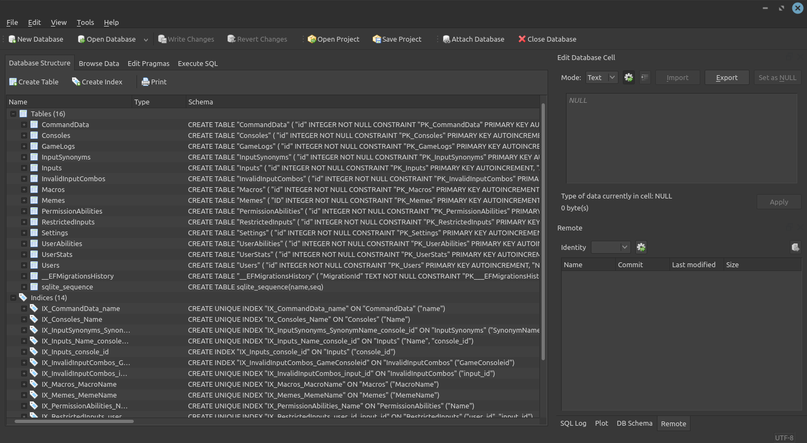

Welcome! This is a quick guide to TRBot's data and how to manage it. It's highly recommended to read through this at least once before setting up your stream.

If you already know SQLite, you can skip directly to the sections most relevant to you.

# Intro
First, run TRBot at least once to generate a **TRBotData.db** database file. This is a SQLite database file that TRBot regularly reads and writes to.

Whenever you make a change to the data, whether inside or outside of TRBot, it will be reflected in TRBot immediately (outside a few exceptions: see below). This allows you to change your data without having to restart TRBot. Some uses for this include adding new commands, changing user data, and modifying messages. This is a big improvement from the 1.X versions, which didn't feature such robust data management!

# Viewing data
It's recommended to use a SQLite database viewer such as [SQLiteBrowser](https://sqlitebrowser.org/) or [SQLiteStudio](https://github.com/pawelsalawa/sqlitestudio). It's also possible to use the SQLite CLI to view and modify data, but that is out of scope for this tutorial. This tutorial will presume that you are using a database viewer, specifically SQLiteBrowser.

## Opening the database
Open SQLiteBrowser and click File > Open Database, then load in your **TRBotData.db** file. You should see a view similar to this one:

## Tables
The tables you see in the database are, in short, the categories of data TRBot stores. Below are brief descriptions of each.

- **CommandData** - Holds all data on commands, such as command names, permission levels, and the actual code they link to.
- **Consoles** - The available game consoles, each of which determines the available inputs that can be put into chat.
- **GameLogs** - Stores time-stamped logs that users can add on stream. Useful for tracking game progress.
- **InputSynonyms** - Stores console-specific synonyms correlating to inputs.
- **Inputs** - Contains all available inputs. Inputs are console-specific and have button and axes values.
- **InvalidInputCombos** - Console-specific input combinations that are not allowed. This can include soft reset button combinations.
- **Macros** - Contains all available input macros.
- **Memes** - Contains all available memes.
- **PermissionAbilities** - Contains all available abilities that can be granted or revoked to users. Typically, this does not change much over time.
- **RestrictedInputs** - References inputs that each user is restricted from performing.
- **Settings** - Contains a myriad of bot settings.
- **UserAbilities** - Contains all granted abilities and which users they belong to.
- **UserStats** - Contains all user-specific stats, such as valid input and message count.
- **Users** - Contains all user data.

The **sqlite_sequence** and **__EFMigrationsHistory** tables are automatically generated and should not be modified.

The Indices likewise should not be modified and exist as a means to improve performance.

## Browsing data
While the database is open, click on the Browse Data tab in SQLiteBrowser. You can select the table you want to browse, which will show all the rows in that table. This is how you can view all of TRBot's data!

You can select a column by clicking on it. If the Edit Database Cell menu isn't up, open it with View > Edit Database Cell. You can modify the data for the selected column and apply it. Note that the change hasn't been saved yet! To save changes, hit CTRL + S or click on File > Write Changes.

If you want to revert the changes you've applied but have not yet saved, click on File > Revert Changes.

# Notable Settings
Unless noted otherwise, all of the following settings are under the "Settings" table in the database.

- [`main_thread_sleep`](./Settings-Documentation.md#main_thread_sleep) - Indicates how much time, in milliseconds, to sleep the main thread. This is used to throttle TRBot's main loop so it doesn't use up as much CPU time on your machine. Values too high may noticeably delay the execution of bot routines and messages.
- [`first_launch`](./Settings-Documentation.md#first_launch) - Indicates the first ever launch of TRBot. This sets up all the default game consoles. Starts at 0 then gets set to 1.
- [`force_init_defaults`](./Settings-Documentation.md#force_init_defaults) - If 1, initializes all default values, including default commands, permissions, and settings, if the don't already exist.
- [`data_version`](./Settings-Documentation.md#data_version) - The version for TRBot's data. If this is behind the bot version being used, it will automatically set force_init_defaults to 1 and add missing data.
- [`client_service_type`](./Settings-Documentation.md#client_service_type) - The type of client service connection to use. 0 = Terminal, 1 = Twitch. **Requires restarting TRBot to apply.**
- [`joystick_count`](./Settings-Documentation.md#joystick_count) - The number of virtual controllers to use.
- [`last_vcontroller_type`](./Settings-Documentation.md#last_vcontroller_type) - The type of virtual controller to use. If the one specified is not available on your platform, it will be switched to the default available one automatically.
- [`last_console`](./Settings-Documentation.md#last_console) - The game console to use.
- [`message_cooldown`](./Settings-Documentation.md#message_cooldown) - Indicates how much time, in milliseconds, each message can be sent in max. This acts as a message throttler for platforms with rate-limiting on bots.

For more information on settings, view the [settings documentation](./Settings-Documentation.md).

# Reloading data
TRBot comes with a [`ReloadCommand`](../TRBot/TRBot.Commands/Commands/ReloadCommand.cs), mapped to "reload" by default, to reload data. Some data cannot be applied to TRBot until it is reloaded for technical reasons. There are two types of reloads: soft and hard. Hard reloads typically destroy in-memory objects then recreate them using data from the database, while soft reloads typically only apply the changes. Pass "soft" or "hard" as an argument to this command to choose how to reload (Ex. "!reload hard").

# Data requiring reloads/restarts

## CommandData
All commands require code to function and thus are stored in memory as separate objects using information from the CommandData table. If TRBot is running, you will need to reload to apply any changes made directly to the CommandData table.

## client_service_type
The change in the client service used requires a full restart of TRBot to apply. This may be changed in future versions.
